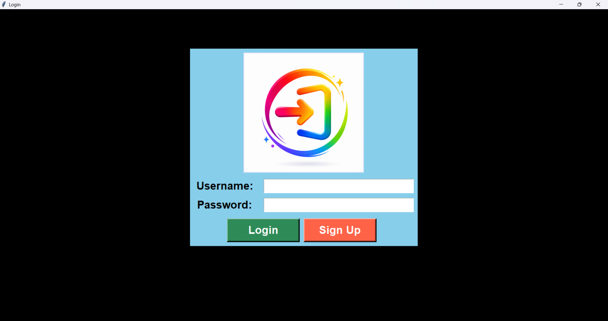
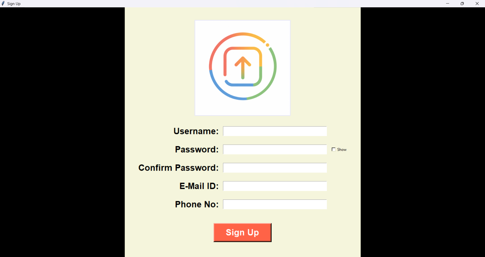

# Login & Registration System using Python Tkinter

## Project Overview

This project is a desktop-based **Login & Registration System** developed using **Python** and **Tkinter**. It allows users to register with their details, log in using valid credentials, and access a personalized welcome screen after successful authentication.

The application demonstrates GUI development, file handling, user authentication, input validation, and multi-window navigation.

---

## Features

- User Registration
- Login Authentication
- Password Confirmation Validation
- Username Uniqueness Check
- Email Validation
- Duplicate Email Detection
- Phone Number Validation
- Show/Hide Password Option
- Personalized Welcome Screen
- Logout Functionality
- Local File-Based User Data Storage

---

## Technologies Used

- Python
- Tkinter
- Pillow (PIL)
- File Handling

---

## Project Structure

```text
Login-Registration-System/
│
├── login.py
├── Sign_up.py
├── Welcome.py
├── user_details.txt
├── Assets/
│   ├── Sign_in_logo.png
│   ├── Sign_up_logo.png
│   └── Welcome_logo.png
├── Screenshot/
│   ├── Login.png
│   ├── Signup.png
│   └── Welcome.png
├── .gitignore
└── README.md
```

---

## Screenshots

### Login Page



### Registration Page



### Welcome Page


---

## Prerequisites

Before running the application, make sure you have:

- Python 3 installed
- Pillow library installed

Install Pillow using:

```bash
pip install pillow
```

---

## How to Run

1. Clone the repository:

```bash
git clone https://github.com/Janvi-Rathore/login-registration-system-python.git
```

2. Navigate to the project folder:

```bash
cd login-registration-system-python
```

3. Install the required dependency:

```bash
pip install pillow
```

4. Run the application:

```bash
python login.py
```

---

## Validation Implemented

- All fields are mandatory.
- Username must be unique.
- Email must be unique.
- Password and Confirm Password must match.
- Password must contain at least 6 characters.
- Email must be in a valid format.
- Phone number must contain exactly 10 digits.
- Appropriate error messages are displayed for invalid inputs and unsuccessful login attempts.

--- 

## Future Improvements

- Store user data in an SQLite database.
- Encrypt passwords before storing them.
- Add a "Forgot Password" feature.
- Improve password strength validation.
- Add user profile management.
